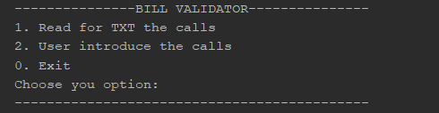
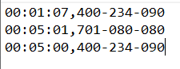
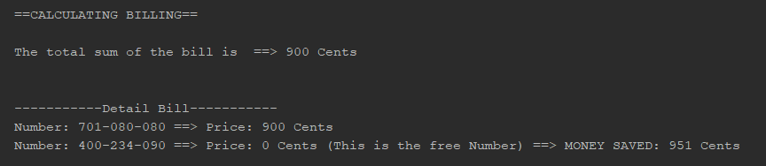

# Phone Bill #

This program is a phone bill validator. Thanks to it you can check if they have charged you the price of your bill correctly!

The program has a menu where you can choose whether:

1.Read the calls with a file (Recommended).

2.The user introduce the calls by keyboard.

The format of the calls has to be as you can see in the following image.

The file where the calls must be entered must be in the root and must be called "bill.txt"

The code can be found in the following path: PhoneBill/src/main/scala

To test the program you must run the following application src/main/scala/apps/PhoneBillApp.scala

When the program ends, it will show the total price of the bill and the detail.

### Developed by: Dámaso Sánchez Arenas
